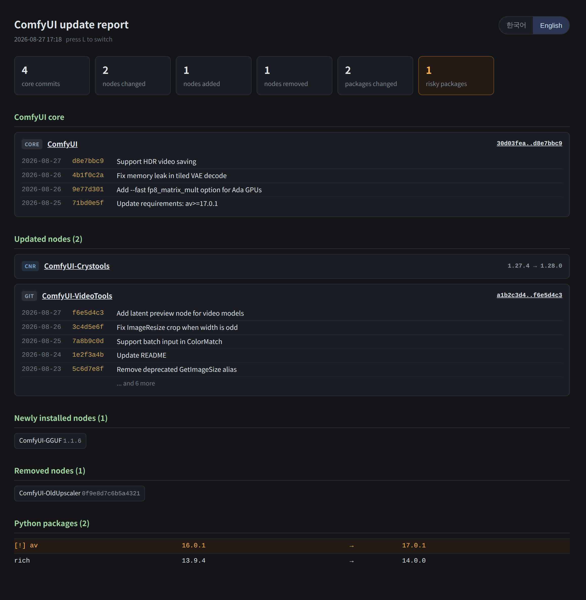
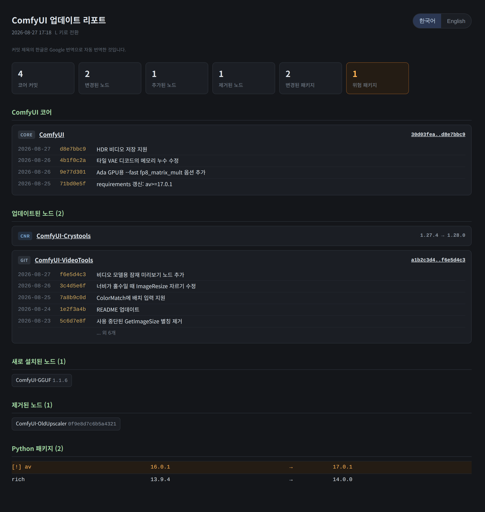

# ComfyUI Update Detail Information

**See exactly what changed the last time you updated ComfyUI.**

ComfyUI updates are silent. `git pull` runs, ComfyUI-Manager updates a hundred node
packs, pip quietly moves `numpy` half a version — and all you get is a console that
scrolls past. When something breaks an hour later, there is no record of what moved.

This adds one line to your update script. After every update you get:

```
::::::::::: ComfyUI update report (2026-08-27 17:18) :::::::::::
  core        30d03fea -> d8e7bbc9  (4 commits)
  nodes       changed 2 / added 1 / removed 1
  packages    changed 2  [!] av 16.0.1 -> 17.0.1
  translated  9 commit subjects (Google Translate)
  report      ...\_update-report\reports\2026-08-27_1718.html
```

*(shown with `--lang en`; the console speaks Korean unless you ask otherwise)*

…and a full HTML page that opens in your browser: every core commit with its subject
and date, every node that moved with a GitHub compare link, every package version
change, with the ones that habitually break ComfyUI flagged.

**Korean and English, in one page.** The report ships both languages and switches
between them with the `한국어 / English` buttons in the corner — or the `L` key. Your
choice is remembered for every later report. It opens in Korean; `--lang en` changes
that. Commit subjects are **translated into Korean automatically through Google
Translate** — nothing to install, nothing to configure. A local LLM can do the job
instead if you prefer; see [Korean commit subjects](#korean-commit-subjects).

**Nothing has to run before an update.** The previous report's snapshot is the baseline.

---

## Screenshots

The same report, in both languages. One file — the buttons in the corner (or the `L`
key) switch between them.

**English** — `--lang en`, or the `English` button



**한국어** — the default. Commit subjects are Korean here, translated by Google Translate;
the originals are one keypress away.



---

## Install

1. Download this repository ([ZIP](https://github.com/ssain3d-lgtm/Comfyui-Update-Detail-Information/archive/refs/heads/main.zip)).
2. Copy **`Update-Report.bat`** and the **`_update-report`** folder into your ComfyUI
   install — the folder that contains `ComfyUI\` and `python_embeded\`:

   ```
   ComfyUI_windows_portable\        <- put them here
     ComfyUI\
     python_embeded\
     update\
     Update-Report.bat             <- copied
     _update-report\               <- copied
   ```

3. Double-click **`Update-Report.bat`** once. It saves a baseline and tells you so.
4. *(optional, recommended)* Double-click **`_update-report\reinject.bat`** to hook the
   report into your update scripts, so it runs by itself after every update.

That's it. Update ComfyUI as you always do; the report shows up when it finishes.

### Supported layouts

Auto-detected, no configuration:

| Layout | Python it finds |
|---|---|
| ComfyUI portable (`ComfyUI_windows_portable`) | `python_embeded\python.exe` |
| [ComfyUI-Easy-Install](https://github.com/ivo-toby/ComfyUI-Easy-Install) | `python_embeded\python.exe` |
| venv install | `venv\` / `.venv\` / `ComfyUI\venv\` |
| anything else | `python` on `PATH` |

Requires **Python 3.8+** and **git** on `PATH`. Python 3.11+ parses `pyproject.toml`
properly; older versions fall back to a regex and work fine.

### Linux / macOS

The `.bat` hook is Windows-only, but the report itself is not. Run it by hand after
updating:

```sh
./update-report.sh              # or: python3 _update-report/update_report.py
```

---

## What it tracks

| Thing | How | Shown as |
|---|---|---|
| ComfyUI core | git `HEAD` | `git log old..new` — date, sha, subject + GitHub compare link |
| git-installed nodes | git `HEAD` | same (capped at 20 commits, rest counted) |
| registry (cnr) nodes | `version` in `pyproject.toml` | `1.27.4 → 1.28.0` + repo link |
| new / removed nodes | folder listing | their own section |
| Python packages | `importlib.metadata` | every version change |

### Risky packages

These get pulled out and flagged, because when one of them shifts under you ComfyUI
usually stops starting:

`av` · `numpy` · `scipy` · `numba` · `llvmlite` · `torch` · `torchvision` ·
`torchaudio` · `torchsde` · `torchcodec` · `xformers` · `opencv-python*` ·
`transformers` · `diffusers` · `safetensors` · `pillow`

That list exists because of a real incident: an update script kept silently reinstalling
`av==16.0.1` while ComfyUI needed `17.0.1`, and the only symptom was an `ImportError` on
startup with no clue which update caused it.

---

## Usage

```
Update-Report.bat [options]

  --comfy PATH     path to the ComfyUI directory (auto-detected otherwise)
  --lang ko|en     console language, and the language the report opens in (default: ko)
  --baseline       overwrite the snapshot without reporting
  --no-open        don't open the HTML report in a browser
  --no-color       plain console output
  --no-pause       don't wait for a keypress (used by the hook)
  --translator X   what translates commit subjects: google (default) or llm
  --no-translate   don't translate commit subjects at all
  --llm URL        OpenAI-compatible endpoint; implies --translator llm
  --llm-model ID   model to translate with
  --llm-key KEY    API key, if the server wants one
  --reinject       re-add the hook to your update scripts
  --help           show this
```

The hook passes no options, so put anything you want to be permanent in
`_update-report\config.json` (copy `config.example.json`):

```json
{ "lang": "en", "translate": true, "translator": "google",
  "llm_url": null, "llm_model": null, "llm_key": null }
```

Command line beats `COMFY_REPORT_LANG` / `COMFY_REPORT_TRANSLATOR` / `COMFY_REPORT_LLM` /
`COMFY_REPORT_LLM_KEY` in the environment, which beats `config.json`.

Reports pile up in `_update-report\reports\` as `YYYY-MM-DD_HHMM.html`. They're a few KB
each; delete them whenever.

---

## Korean commit subjects

The page's own wording is written in both languages. Commit subjects come from git, so
they arrive in whatever the upstream author wrote — usually English. The Korean side of
the toggle shows them translated, with the original still one keypress away.

### Google Translate (default)

Out of the box the subjects go through **Google Translate** — the same endpoint the
translate.google.com page uses, so there is no API key, no account and nothing to set
up. They are sent in small batches, a whole report takes a second or two, and the result
is cached in `_update-report\translations.json` so a subject is only ever translated
once.

Two things worth knowing:

- **Subjects leave your machine.** Only the commit subject lines — never file paths,
  package lists or anything else from your install. If that is not acceptable, use
  `--no-translate` or switch to a local LLM below.
- **Offline is fine.** No network, or Google turning the request down, means the report
  is built exactly as before with English subjects on both sides, and the console says
  so. Nothing waits longer than ten seconds.

Google Translate is a general-purpose translator, so it will occasionally take a swing at
a code identifier. The English original is always in the file.

### A local LLM instead

An OpenAI-compatible server (LM Studio, llama.cpp, Ollama, …) can translate instead — it
is told to keep model names, file paths, flags and version numbers in English, which
Google does not always do. Ask for it with `--translator llm`, or just point at a server
with `--llm URL` (that alone selects it). Without a URL these are probed in order, and
the first one that answers is used:

| Server | Endpoint |
|---|---|
| LM Studio | `http://127.0.0.1:1234/v1` |
| llama.cpp (`llama-server`) | `http://127.0.0.1:8080/v1` |
| Ollama | `http://127.0.0.1:11434/v1` |

Nothing listening? Nothing happens — the report is built without Korean subjects, with
no delay worth measuring (a closed local port refuses instantly). Pick the model with
`--llm-model`.

If the server wants an API key — LM Studio does once its local API token is switched on —
pass `--llm-key`, or set `COMFY_REPORT_LLM_KEY` / `LM_API_TOKEN` / `OPENAI_API_KEY`. The
console says so when a server turns the request down instead of failing silently.

Either way the page says the Korean subjects are machine-translated, and by what.

---

## How the hook survives

`reinject.bat` adds two lines to your update script, just above the point where ComfyUI
starts:

```bat
:: ---- ComfyUI update report ----
if exist "%~dp0Update-Report.bat" call "%~dp0Update-Report.bat" --no-pause
```

The original is backed up next to it as `*.bak-hook`.

Some distributions rewrite their own update scripts when they self-update
(ComfyUI-Easy-Install does), which drops those lines. **Run `reinject.bat` again** — it's
idempotent, and `Update-Report.bat` keeps working by hand regardless.

Scripts that end in `:label` subroutines are skipped rather than patched, since appending
there would put the hook inside a subroutine. When a root-level updater exists, the
scripts it calls are left alone so the report doesn't run twice.

---

## Notes and limits

- **First run only saves a baseline.** Real diffs start with the second run.
- Merge commits are hidden (`--no-merges`). Every real change still appears.
- If a repo was force-pushed or shallow-cloned, the commit list may be unavailable —
  the report says so and still shows the sha transition.
- `state.json` holds your node list and installed package versions. It stays local; it's
  gitignored here.
- Reading is all it does: `git rev-parse`, `git log`, and file reads. It never writes to
  your repos. The only files it modifies are the update `.bat` files you point
  `reinject.bat` at, and those are backed up first.
- The only network traffic is the translation: commit subjects to Google Translate, or
  to the local LLM you chose. `--no-translate` turns that off entirely.

## Tests

```
python _update-report/test_update_report.py     # 132 tests
python _update-report/test_translate.py         #  79 tests
python _update-report/test_inject_hook.py       #  27 tests
python _update-report/test_i18n.py              #  21 tests
```

No dependencies — standard library only. The translation tests never touch the network.

## License

[MIT](LICENSE) — use it, change it, ship it, no strings attached.

---
---

# 한국어

## 이게 뭔가요

ComfyUI를 업데이트하면 뭐가 바뀌었는지 알 수가 없습니다. `git pull` 돌아가고, 노드
수십 개가 갱신되고, pip가 조용히 `numpy` 버전을 바꿔놓고, 콘솔은 그냥 지나갑니다.
한 시간 뒤에 뭔가 깨져도 **무엇이 움직였는지 남은 기록이 없습니다.**

이 도구는 업데이트 스크립트에 한 줄을 넣어서, 업데이트가 끝나면 자동으로 변경내역을
보여줍니다. 콘솔에는 요약 몇 줄, 브라우저에는 상세 페이지 — 코어 커밋 전체(날짜·SHA·제목),
바뀐 노드마다 GitHub compare 링크, 패키지 버전 변화까지.

**한글과 영문이 한 파일에 같이 들어갑니다.** 리포트 오른쪽 위 `한국어 / English` 버튼,
또는 **`L` 키**로 언제든 바꿀 수 있고, 고른 언어는 다음 리포트에서도 그대로 유지됩니다.
기본값은 한글이고 `--lang en` 으로 바꿉니다. **커밋 제목은 Google 번역으로 자동 번역**되어
한글 화면에 들어갑니다 — 설치할 것도, 설정할 것도 없습니다. 원하면 로컬 LLM으로 대신
번역할 수도 있습니다. 아래 [커밋 제목 번역](#커밋-제목-번역) 참고.

```
::::::::::: ComfyUI 업데이트 리포트 (2026-08-27 17:18) :::::::::::
  코어        30d03fea -> d8e7bbc9  (커밋 4개)
  노드        변경 2 / 추가 1 / 제거 1
  패키지      변경 2  [!] av 16.0.1 -> 17.0.1
  번역        커밋 제목 9개 (Google 번역)
  리포트      ...\_update-report\reports\2026-08-27_1718.html
```

**업데이트 전에 미리 실행해둘 필요가 없습니다.** 직전 리포트의 스냅샷이 기준점입니다.

## 스크린샷

기본 화면(한글)입니다. 커밋 제목은 Google 번역으로 옮긴 것이고, `English` 버튼이나 `L` 키를
누르면 같은 페이지가 영문 원문으로 바뀝니다. 영문 화면은 위쪽
[Screenshots](#screenshots) 에 있습니다.


## 설치

1. 이 저장소를 [ZIP으로 받습니다](https://github.com/ssain3d-lgtm/Comfyui-Update-Detail-Information/archive/refs/heads/main.zip).
2. **`Update-Report.bat`** 과 **`_update-report`** 폴더를 ComfyUI 설치 폴더
   (`ComfyUI\` 와 `python_embeded\` 가 들어있는 그 폴더)에 복사합니다.
3. **`Update-Report.bat`** 을 한 번 더블클릭 → 기준점이 저장됩니다.
4. *(권장)* **`_update-report\reinject.bat`** 을 더블클릭 → 업데이트 스크립트에 훅이
   들어가서, 이후로는 업데이트가 끝날 때마다 알아서 뜹니다.

포터블 / Easy-Install / venv 설치를 알아서 구분하고, 파이썬도 알아서 찾습니다.
`git` 이 PATH에 있어야 합니다. 리눅스·맥은 `.bat` 훅 대신 `update-report.sh` 를 직접 실행하세요.

## 추적 대상

| 대상 | 방식 | 표시 |
|---|---|---|
| ComfyUI 코어 | git `HEAD` | `git log old..new` 커밋 목록 + compare 링크 |
| git 설치 노드 | git `HEAD` | 동일 (커밋 20개 초과분은 개수만) |
| 레지스트리(cnr) 노드 | `pyproject.toml` 의 `version` | `1.27.4 → 1.28.0` |
| 신규 / 제거 노드 | 폴더 목록 비교 | 별도 섹션 |
| Python 패키지 | `importlib.metadata` | 버전 변경 전체 |

`av` `numpy` `scipy` `torch*` `opencv*` `numba` 같은 **위험 패키지**는 따로 강조합니다.
업데이트 스크립트가 `av` 를 16.0.1로 계속 되돌려놓는 바람에 ComfyUI가 `ImportError` 로
안 뜨는데 어느 업데이트가 원인인지 알 수 없었던 실제 사고에서 나온 목록입니다.

## 커밋 제목 번역

리포트의 UI 문구는 한/영이 처음부터 둘 다 들어 있습니다. 커밋 제목은 git 에서 그대로
가져오는 것이라 대개 영문인데, 한글 화면에서는 이것도 번역해서 보여줍니다. 토글을 영문으로
돌리면 원문이 그대로 나옵니다.

### Google 번역 (기본)

아무 설정 없이 **Google 번역**을 씁니다. translate.google.com 페이지가 쓰는 것과 같은
주소라 API 키도, 계정도 필요 없습니다. 제목 여러 개를 묶어서 보내기 때문에 리포트 하나에
1~2초면 끝나고, 결과는 `_update-report\translations.json` 에 캐시되어 같은 커밋을 두 번
번역하지 않습니다.

알아둘 점 두 가지:

- **커밋 제목이 외부로 나갑니다.** 딱 제목 줄만 갑니다. 파일 경로, 패키지 목록 같은 설치
  정보는 보내지 않습니다. 그래도 싫으면 `--no-translate` 로 끄거나 아래 로컬 LLM을 쓰세요.
- **오프라인이어도 됩니다.** 인터넷이 없거나 Google이 요청을 거절하면, 번역 없이(=영문
  그대로) 리포트가 나오고 콘솔에 그렇다고 찍힙니다. 최대 10초 이상 기다리지 않습니다.

범용 번역기라 가끔 코드 식별자까지 번역해버릴 때가 있습니다. 영문 원문은 항상 파일 안에
함께 들어 있습니다.

### 로컬 LLM으로 대신하기

OpenAI 호환 서버(LM Studio·llama.cpp·Ollama 등)가 있으면 그쪽으로 번역할 수 있습니다.
모델명·파일 경로·옵션·버전 숫자는 영문 그대로 두라고 지시하기 때문에 그 부분은 Google
번역보다 낫습니다. `--translator llm` 으로 고르거나, `--llm URL` 로 서버를 지정하면
그것만으로 LLM이 선택됩니다. URL 없이는 아래 순서로 찾아보고, 먼저 응답하는 쪽을 씁니다.

| 서버 | 주소 |
|---|---|
| LM Studio | `http://127.0.0.1:1234/v1` |
| llama.cpp (`llama-server`) | `http://127.0.0.1:8080/v1` |
| Ollama | `http://127.0.0.1:11434/v1` |

아무것도 안 켜져 있으면 그냥 번역 없이 리포트가 나옵니다. 닫힌 로컬 포트는 즉시 거절되기
때문에 느려지지도 않습니다. 모델 지정은 `--llm-model` 입니다.

**LM Studio 는 설정에서 로컬 API 토큰을 켜두면 키를 요구합니다.** 그때는 `--llm-key`
(또는 환경변수 `COMFY_REPORT_LLM_KEY` / `LM_API_TOKEN` / `OPENAI_API_KEY`)로 넘기세요.
키 때문에 거절당하면 콘솔에 그렇다고 찍힙니다. 조용히 넘어가지 않습니다.

어느 쪽이든 기계 번역이므로 리포트에 무엇으로 번역했는지 적어둡니다.

## 고정 설정

훅은 옵션 없이 실행되기 때문에, 계속 쓸 설정은 `_update-report\config.json` 에 둡니다
(`config.example.json` 복사):

```json
{ "lang": "ko", "translate": true, "translator": "google",
  "llm_url": null, "llm_model": null, "llm_key": null }
```

`translator` 는 `google` 또는 `llm`. 우선순위는 명령줄 > 환경변수 > `config.json` 입니다.

## 훅이 사라졌을 때

ComfyUI-Easy-Install 처럼 자기 업데이트 스크립트를 통째로 덮어쓰는 배포판이 있습니다.
그러면 넣어둔 훅 두 줄도 같이 날아갑니다. → **`reinject.bat` 을 다시 실행**하면 됩니다
(몇 번을 돌려도 중복되지 않습니다). 원본은 `*.bak-hook` 으로 백업됩니다.
훅이 없어도 `Update-Report.bat` 수동 실행은 항상 됩니다.

## 알아둘 점

- **첫 실행은 기준점만 저장**합니다. 실제 변경내역은 두 번째 실행부터 나옵니다.
- 머지 커밋은 숨깁니다(`--no-merges`). 실제 변경 커밋은 다 나옵니다.
- 강제 푸시나 얕은 클론이면 커밋 목록을 못 가져올 수 있습니다. 그때는 SHA 전환만 표시합니다.
- `state.json` 에는 노드 목록과 설치 패키지 버전이 들어갑니다. 로컬에만 남고 gitignore 됩니다.
- 읽기만 합니다. 저장소에 쓰지 않습니다. 수정하는 파일은 `reinject.bat` 이 훅을 넣는
  업데이트 `.bat` 뿐이고, 그것도 먼저 백업합니다.
- 네트워크는 번역에만 씁니다 — 커밋 제목을 Google 번역이나 지정한 로컬 LLM에 보내는 것이
  전부이고, `--no-translate` 면 그것도 없습니다.

## 라이선스

[MIT](LICENSE). 가져다 쓰든 고쳐 쓰든 재배포하든 제약 없습니다.
